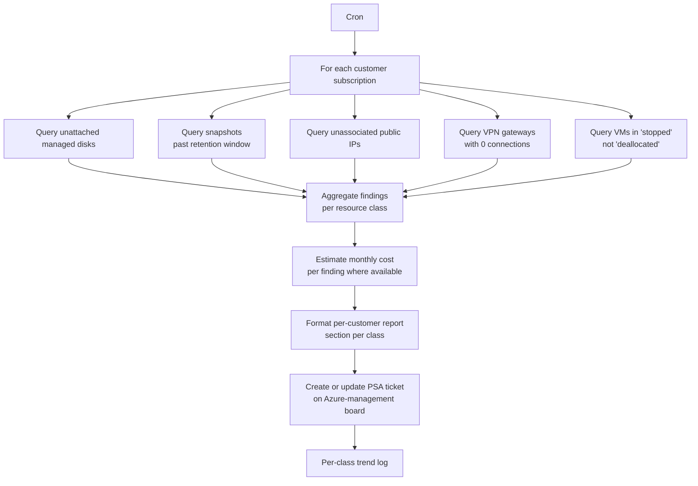

# Azure Proactive Resource Audit

**Category:** azure-governance
**Primary tools:** Microsoft Azure (ARM), ConnectWise PSA
**Orchestrator:** tool-agnostic (originally Rewst)
**Status:** Production
**Effort to build:** M

## Problem
Azure subscriptions accumulate resources that quietly cost money:

- Unattached managed disks left over from VM deletions.
- Snapshots created during a one-time backup that nobody cleaned up.
- Public IP addresses with no associated NIC or load balancer.
- VPN gateways with no live connection.
- Stopped (not deallocated) VMs still consuming compute charges.

None of these will trigger a customer alarm. All of them, summed across a large customer base, are real recurring waste. A scheduled audit converts cleanup from "we should do that someday" into a routine TAM-managed conversation.

## Trigger
Cron — weekly or monthly, depending on customer cadence.

## Data sources
- Microsoft Azure (per customer subscription, via ARM): managed disks, snapshots, public IP addresses, VPN gateways and connections, VMs (with power state).
- ConnectWise PSA: customer-to-subscription mapping; the board to file findings on.

## Flow shape

1. Cron fires.
2. For each managed customer with Azure subscriptions, resolve to the in-scope subscription IDs.
3. For each subscription, run the resource-class queries:
   - Managed disks: list disks where `managedBy` is null (unattached).
   - Snapshots: list all snapshots; flag those older than the configured retention window.
   - Public IPs: list public IPs where `ipConfiguration` is null (unassociated).
   - VPN gateways: list gateways and their connections; flag gateways with zero connected sites.
   - VMs: list VMs with power state of `stopped` (as opposed to `deallocated`).
4. For each finding class, build a structured row: resource ID, name, region, resource group, age, estimated monthly cost (from the Azure pricing data, or skip if not available).
5. Aggregate findings per customer.
6. Format a per-customer report with a section per class.
7. Create or update a ConnectWise ticket on the customer's Azure-management board with the report.
8. Log per-class counts and total estimated savings for trend analysis.

## Outputs / side effects
- ConnectWise ticket per customer with the resource-audit report.
- Trend log so the MSP can track how cleanup is going over time per customer (does the unattached-disk count keep growing, or is the cleanup keeping up?).

## Outcome / value
A recurring stream of "here's specifically what to delete and how much it'll save" tickets. The customer-facing benefit is real cost savings (often more than the customer expects). The MSP-facing benefit is a regular, structured artifact that demonstrates ongoing optimization work — which is the kind of thing that justifies a managed-services premium over commodity hosting.

The audit also surfaces architectural drift: if a customer's unattached-disk count keeps growing, somebody is decommissioning VMs without cleaning up storage. That's a process-fix conversation, not just a delete-the-disks conversation.

## Gotchas
- Don't auto-delete. Recommend, ticket, and let a human action it. Deleted disks and snapshots are very hard to un-delete.
- Snapshots sometimes back legal-hold data. Maintain a tag or convention that marks "do not delete" snapshots and respect it.
- Stopped vs. deallocated VMs is a notorious Azure footgun. A VM that was shut down from inside the OS shows as "stopped" and still bills full compute. Surface this clearly — most operators don't know the distinction.
- Estimated cost figures are ballpark; document the assumptions inside the report so a reader doesn't treat them as authoritative.
- VPN gateway findings need a tolerance window — connections drop briefly during normal operations. Flag only gateways whose connected count has been zero for several consecutive runs.

## Dependencies
- Azure ARM read access into customer subscriptions.
- ConnectWise PSA API credentials with write on tickets.
- **Secure Azure customer-tenant authentication** *(coming)*
- [Error-handling pattern](../platform-ops/error-handling-with-ticket-creation.md).

## Related patterns
- [Azure Reserved Instance Utilization Check](./azure-ri-utilization-check.md)
- **Azure backup monitoring** *(coming)*
