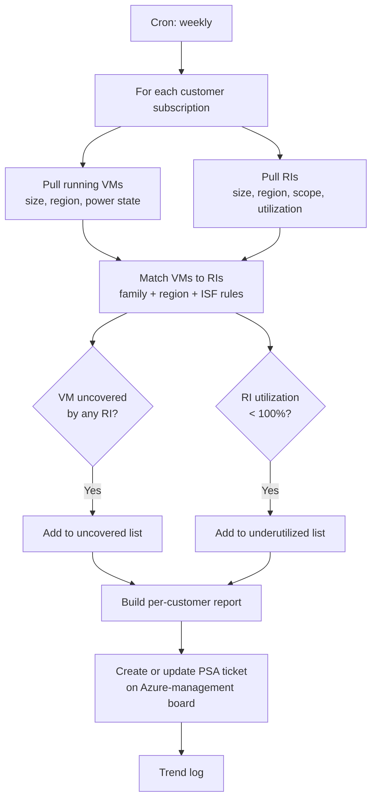

# Azure Reserved Instance Utilization Check

**Category:** azure-governance
**Primary tools:** Microsoft Azure (ARM), ConnectWise PSA
**Orchestrator:** tool-agnostic (originally Rewst)
**Status:** Production
**Effort to build:** M

## Problem
Reserved Instances (RIs) are how Azure customers get meaningful cost discounts on long-running compute — but only if those RIs are actually being utilized. Two failure modes silently waste money:

1. RIs that aren't 100% utilized (the discounted hours aren't being applied because the matching VM is off, mis-sized, or in the wrong region).
2. Running VMs that aren't covered by an RI at all (paying on-demand for compute that should be reserved).

Both go unnoticed unless somebody is looking. A weekly automated check turns this into a recurring hygiene task instead of a quarterly fire drill.

## Trigger
Cron — weekly.

## Data sources
- Microsoft Azure (per customer subscription, via ARM): all running VMs (size, region, lifecycle state, power state); all Reserved Instances (size, region, scope, utilization percentage).
- ConnectWise PSA: customer-to-subscription mapping; the agreement/board on which findings should be tracked.

## Flow shape

1. Cron fires.
2. For each managed customer with Azure subscriptions, resolve the in-scope subscription IDs.
3. For each subscription, pull all running VMs with their size, region, and power state.
4. Pull all Reserved Instances for the subscription with their size, region, scope, and current utilization percentage.
5. Match running VMs against RIs:
   - Each running VM should be covered by an RI of the same size in the same region (or compatible via instance-size flexibility).
   - Each RI should be applied at 100% utilization. Anything less means there are reserved hours nobody is consuming.
6. Build two finding lists:
   - **Uncovered VMs** — running VMs with no matching RI. Candidate for purchase if usage is durable.
   - **Underutilized RIs** — RIs with utilization < 100%. Candidate for cancellation, scope change, or VM right-sizing.
7. Format findings as a per-customer summary report.
8. Create a ConnectWise ticket on the customer's Azure-management board with the report. If a previous run's ticket is still open, append rather than creating a new one.
9. Log run statistics for trend analysis.

## Outputs / side effects
- ConnectWise ticket per customer with the RI utilization report.
- Structured log of uncovered VMs and underutilized RI counts per customer per run.

## Outcome / value
RI waste shows up within a week of the underlying VM change instead of at the end of the reservation term. For customers with sizable Azure footprints this routinely surfaces meaningful annual savings — both directly (cancelling underutilized RIs, right-sizing to match remaining RIs) and indirectly (purchasing RIs for durable on-demand workloads).

For TAMs, this report is a good talking point in customer reviews — it converts an opaque cloud invoice into a clear "here are the levers, here's what we recommend" conversation.

## Gotchas
- Instance-size flexibility (ISF) makes RI matching less straightforward than "same size, same region". A `Standard_D4s_v3` RI in a region partially covers a `Standard_D2s_v3` VM under ISF rules. Encode the family-and-ratio rules explicitly or you'll generate misleading findings.
- "Running" is a power state, not just a provisioning state. A deallocated VM still appears in inventory but doesn't consume RI hours.
- Some customers intentionally run a few uncovered VMs (short-lived dev workloads). Maintain a per-customer ignore list rather than alerting on those weekly.
- Cancelling RIs has a cooldown and a refund cap. Surface the recommendation; let humans decide.
- The utilization-percentage metric from ARM lags the underlying activity by a day or so. Don't use the most recent 24 hours for "100% utilized" judgments; use a rolling window.

## Dependencies
- Azure ARM read access into customer subscriptions (via service principal in the customer tenant, or via secure auth pattern).
- ConnectWise PSA API credentials with write on tickets.
- **Secure Azure customer-tenant authentication** *(coming)*
- [Error-handling pattern](../platform-ops/error-handling-with-ticket-creation.md).

## Related patterns
- [Azure Proactive Resource Audit](./azure-proactive-resource-audit.md)
- **Azure backup monitoring** *(coming)*
- **AVD nightly host-pool rebuild** *(coming)*
