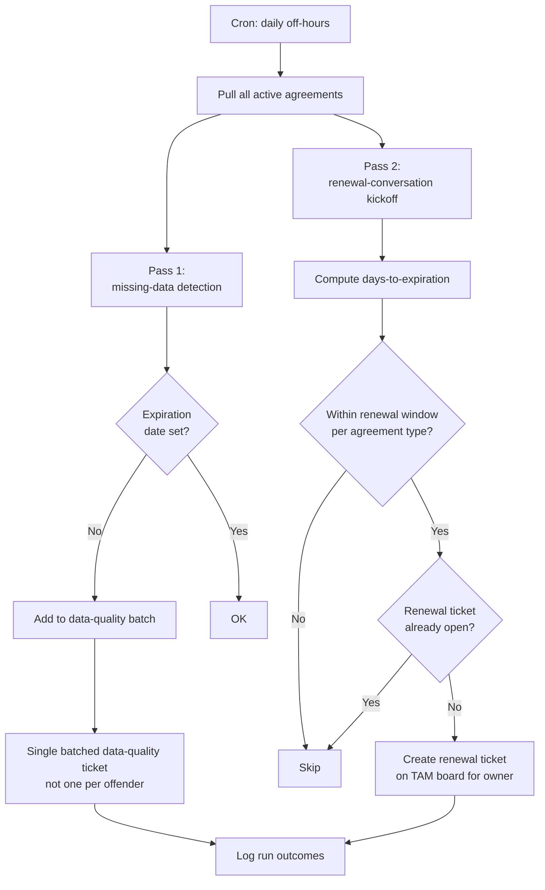

# Contract Expiration Automation

**Category:** finance-billing
**Primary tools:** ConnectWise PSA
**Orchestrator:** tool-agnostic (originally n8n)
**Status:** Production
**Effort to build:** M

## Problem
Managed-services agreements expire, and they need to be renewed before they expire. In practice, two failure modes are common:

1. Agreements have no expiration date populated in the PSA at all (especially older ones), so nothing alerts on them.
2. Agreements have an expiration date but nobody is watching the calendar far enough in advance to start the renewal conversation.

The cost of either is real: a customer whose agreement lapses without a renewal in flight is in a contractually awkward position — the MSP is delivering services without an active agreement covering them. Customer-trust risk if it's noticed; revenue-recognition risk if it's not.

A two-part automation — detect agreements with no expiration date set, and proactively create renewal-conversation tickets a fixed window before expiration — closes both gaps.

## Trigger
Cron — daily, off-hours.

## Data sources
- ConnectWise PSA: all active agreements with their expiration dates, customer/company, agreement type, contracted quantity, renewal terms.
- Internal mapping of which TAM owns which customer.

## Flow shape

1. Cron fires.
2. Pull the full list of active agreements from ConnectWise PSA.
3. Pass 1 — **missing-data detection**:
   - For each agreement, check whether an expiration date is set.
   - For agreements with no expiration date, create (or update) a single ConnectWise ticket on a configured "data quality" board listing the offenders. Send to the operations team that owns agreement data hygiene.
4. Pass 2 — **renewal-conversation kickoff**:
   - For each agreement with an expiration date, compute days-to-expiration.
   - For agreements expiring within the configured renewal window (typically 90 days, sometimes 60 or 120 depending on contract type), check whether a renewal ticket already exists.
   - If no renewal ticket exists, create one on the TAM board, addressed to the TAM who owns the customer. Include: customer, agreement name, expiration date, days-to-expiration, contracted quantity, last-known retail price.
5. Log the day's outcomes: agreements without expiration dates (new vs. previously seen), renewal tickets created, customers in the renewal window already covered by an open ticket.

## Outputs / side effects
- A "data quality" ticket / report listing agreements missing expiration dates.
- New ConnectWise tickets on the TAM board for every customer entering the renewal window.
- Structured log for trend analysis.

## Outcome / value
The "we forgot to renew their contract" failure mode disappears. TAMs get a steady, predictable stream of renewal kickoffs at a fixed runway, instead of getting them all in the last two weeks of every quarter. The data-quality pass forces the missing-expiration-date problem onto someone's plate instead of leaving it as a long-standing latent issue.

Once the pattern is in production it's also visible — leadership can see how many renewals are in-flight at any time, which is a useful planning input that's hard to get otherwise.

## Gotchas
- The renewal window is contract-type-specific. Three-year deals need a longer kickoff than annuals. Encode the window per agreement type.
- Idempotency matters. The cron will run every day; you don't want a new ticket per day for the same renewal. Either check for an existing open ticket, or stamp an "already handled" flag somewhere durable.
- Customers transition between agreements (replacing an older agreement with a newer one mid-term). Don't panic-create a renewal ticket on an agreement that's about to be retired.
- The data-quality ticket should be batched, not per-offender. A team faced with sixty individual tickets ignores all of them; a single ticket listing sixty agreements gets actioned.
- Customer-tenant pricing is sensitive. The renewal ticket should reference current pricing, not historical pricing — but it should be careful about exposing margin assumptions.

## Dependencies
- ConnectWise PSA API credentials with read on agreements; write on tickets.
- A maintained mapping of customer → TAM owner.
- [Error-handling pattern](../platform-ops/error-handling-with-ticket-creation.md).

## Related patterns
- **Annual price increase notification** *(coming)*
- **Inactive additions on active agreements** *(coming)*
