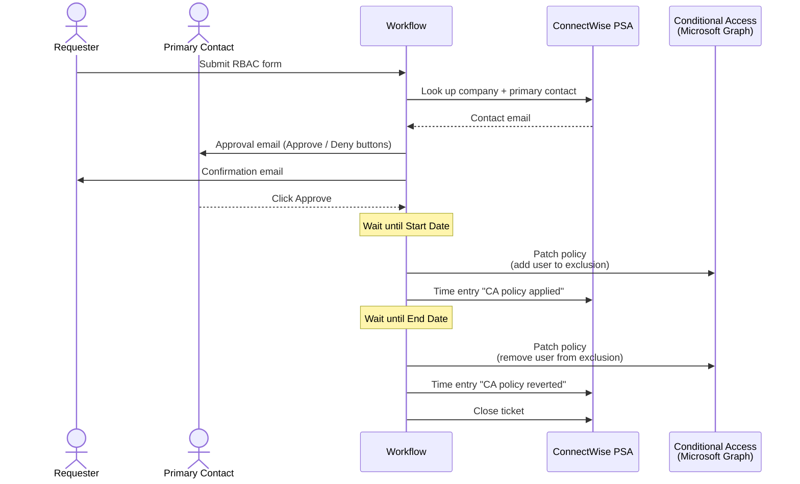

# RBAC Request with Conditional Access Automation

**Category:** identity-access
**Primary tools:** ConnectWise PSA, Microsoft Entra (Conditional Access via Graph)
**Orchestrator:** tool-agnostic (originally Rewst)
**Status:** Production
**Effort to build:** L

## Problem
A managed customer needs to grant temporary elevated access to a user — a contractor, a vendor, a tech for a one-week project. The "right" answer is to add the user to a Conditional Access policy exclusion for the duration of the work and revert it automatically when the period ends. The wrong answers (which is what tends to happen) are: leaving the elevation indefinitely, granting standing privileges, or doing the change manually with no audit trail and no reminder to revert.

A self-service request flow with email-based approval, automated policy modification at the start, and automated revert at the end gives the customer the agility they want while keeping the access window auditable and bounded.

## Trigger
Form submission — a requester fills in: managed company, request ticket reference, start date, end date, target user, justification.

## Data sources
- Form payload.
- ConnectWise PSA: company record, primary contact, the existing request ticket.
- Microsoft Entra (customer tenant): target user, the named Conditional Access policy that controls the privilege.

## Flow shape

1. Form submits. Parse: managed company, ticket ID, start date, end date, target user, justification.
2. Look up the company in ConnectWise PSA. Resolve the customer's primary contact email.
3. Send a dynamic approval email to the primary contact with two actionable buttons (Approve / Deny). Email includes request details (company, ticket, dates, target user, justification).
4. Send a confirmation email to the requester within a short SLA confirming their request is awaiting approval.
5. Wait on the approval response.
   - **Denied:** create a `Request denied` time entry on the PSA ticket; send a denial email to requester and primary contact; close the ticket. Stop.
   - **Approved:** continue.
6. Wait until the start date at the configured local-time boundary.
7. Patch the Conditional Access policy via Graph — add the target user to the policy's exclusion list (or to whichever group the policy excludes).
8. Create a `CA policy applied` time entry on the PSA ticket with the timestamp.
9. Wait until the end date at the configured local-time boundary.
10. Patch the Conditional Access policy again — remove the target user from the exclusion.
11. Create a `CA policy reverted` time entry; close the ticket.
12. Throughout: handle any non-response, error, or late-cancellation as an exception ticket on the appropriate engineering board.

## Outputs / side effects
- A Conditional Access policy in the customer tenant is patched twice — at start to grant the exclusion, at end to revert it.
- The PSA ticket accumulates a chain of time entries documenting each state change with timestamps.
- The ticket is closed at the end of the access window.
- Emails sent: approval request to primary contact, confirmation to requester, denial email if applicable.

## Outcome / value
Temporary elevated access becomes a scoped, time-bounded operation with an automatic revert. The MSP stops being the bottleneck for short-lived access requests, and the customer's primary contact stays in the loop without having to be the operator. The audit trail on the PSA ticket is complete enough to satisfy security review and compliance ask-backs.

## Gotchas
- The "approve" / "deny" buttons in the email must use signed, single-use tokens. Anything weaker is exploitable by anyone with access to the email thread.
- Time-zone discipline. "End date" needs to be a real timestamp the workflow can wait on — pick UTC midnight or local-tenant midnight and document the choice in the form.
- Customers sometimes change their mind partway through. Build a cancel path that reverts immediately rather than waiting for the scheduled end.
- Conditional Access policies vary in shape. Some policies exclude users directly; some exclude a group. Pattern the workflow against group-based exclusion when possible — it's the more durable approach.
- Approval-email button click handling is the most fragile part. Build it as its own service with idempotency, so a double-click doesn't double-grant or double-revert.

## Dependencies
- A trusted form service.
- Customer-tenant Conditional Access write permission (delegated via GDAP or via a per-tenant app registration).
- ConnectWise PSA API credentials with read on companies/contacts; write on tickets and time entries.
- A signed-token service for the approval email buttons.
- [Error-handling pattern](../platform-ops/error-handling-with-ticket-creation.md).

## Related patterns
- [Self-Service Password Reset](./self-service-password-reset.md)
- **GDAP customer-tenant authentication** *(coming)*
- **Ticket portal access form** *(coming)*
