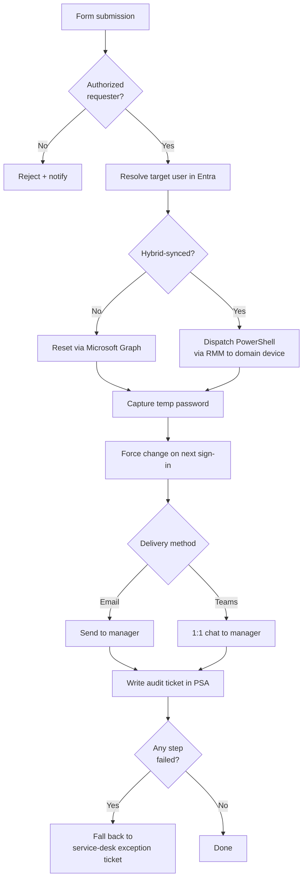

# Self-Service Password Reset (Manager-Initiated)

**Category:** identity-access
**Primary tools:** NinjaOne, Microsoft 365 (Graph), Microsoft Teams
**Orchestrator:** tool-agnostic (originally Rewst)
**Status:** Production
**Effort to build:** M

## Problem
Password resets are the single most common ticket category at most MSPs. Most don't require a tech — a manager asking the service desk to reset a direct report's password is volume the service desk shouldn't be doing. But the manager can't safely run the reset themselves: the reset path differs depending on whether the user is cloud-only or hybrid-synced (in which case the reset must happen on-prem and replicate up), and the temporary-password delivery has to be secure.

A self-service flow that lets an authorized manager reset a direct report's password — with the right reset path picked automatically and the temporary password delivered securely — eliminates a large slice of service-desk volume.

## Trigger
Form submission — a manager fills in a request form (the manager's identity is verified, the target user is selected from their direct reports, the manager picks delivery method).

## Data sources
- The form payload (manager identity, target user, delivery method, number of temporary passwords to generate).
- Microsoft Entra: target user record (sync source — cloud-only vs. hybrid-synced).
- NinjaOne: a managed on-prem device on the customer's domain capable of running PowerShell against the on-prem AD.

## Flow shape

1. Form submits. Validate that the requester is authorized to reset this target user's password (e.g. the requester is the target's manager according to Entra, or the requester is on a configured allow-list for that customer).
2. Resolve the target user in Entra and inspect the `onPremisesSyncEnabled` flag.
3. If cloud-only: call Microsoft Graph to issue a password reset and capture the new temporary password.
4. If hybrid-synced: dispatch a PowerShell script via NinjaOne to a domain-joined device for that customer; the script runs the reset against on-prem AD and returns the new temporary password.
5. Generate the agreed number of temporary passwords (some MSPs issue one; some issue several so the user can pick a memorable one).
6. Deliver the temporary password(s) per the chosen method:
   - Email to the manager (encrypted at rest in transit; not the user's own mailbox if the user is being locked out of mail).
   - One-to-one Teams chat to the manager.
7. Force the user to change the password on next sign-in.
8. Write a confirmation note on a ConnectWise ticket (created automatically for audit trail), including who requested, who was reset, which path was used, and how delivery happened.
9. On any failure, fall back to an exception ticket on the service desk so a human can complete the request.

## Outputs / side effects
- Target user's password reset (cloud or on-prem path).
- Temporary password delivered to the manager via the selected channel.
- ConnectWise audit ticket created with full request and outcome details.
- Forced-change-on-next-sign-in flag set.

## Outcome / value
A meaningful slice of service-desk ticket volume — the "can you reset Jane's password?" cluster — moves to self-service. Time-to-resolution drops from minutes-to-hours (queue time) to seconds. The audit trail is more complete than the manual path because every reset writes a structured ticket. Customers feel like they have agency over their own user lifecycle.

## Gotchas
- Authorization is the make-or-break decision. Get it wrong and you've built a privilege-escalation tool. The "is this requester allowed to reset this target?" check must be airtight; lean on the customer's own org chart in Entra rather than maintaining your own.
- Hybrid detection has to be reliable. Falsely treating a hybrid user as cloud-only resets the cloud password, which then gets overwritten by the next sync — the user is now confused and locked out.
- The on-prem device used for the PowerShell dispatch must be online when the workflow fires. Have a failover device per customer, and fall back to a human ticket if no device responds.
- Delivery channel matters: do not deliver a temporary password to the same mailbox you just locked the user out of. Default to delivering to the *manager*, not the user.
- Rate-limiting: if the form gets abused or scripted, you don't want to issue thousands of resets. Throttle per requester and per target.

## Dependencies
- A trusted form service (whichever the MSP uses), with verified requester identity.
- Microsoft Graph permission to reset user passwords (delegated under GDAP or app-level with consent).
- NinjaOne with PowerShell-script-runner permission and at least one domain-joined device per customer.
- [Error-handling pattern](../platform-ops/error-handling-with-ticket-creation.md).

## Related patterns
- [RBAC Request Workflow with Conditional Access](./rbac-request-with-conditional-access.md)
- **Employee onboarding** *(coming)*
- **Password-reset audit report** *(coming)*
