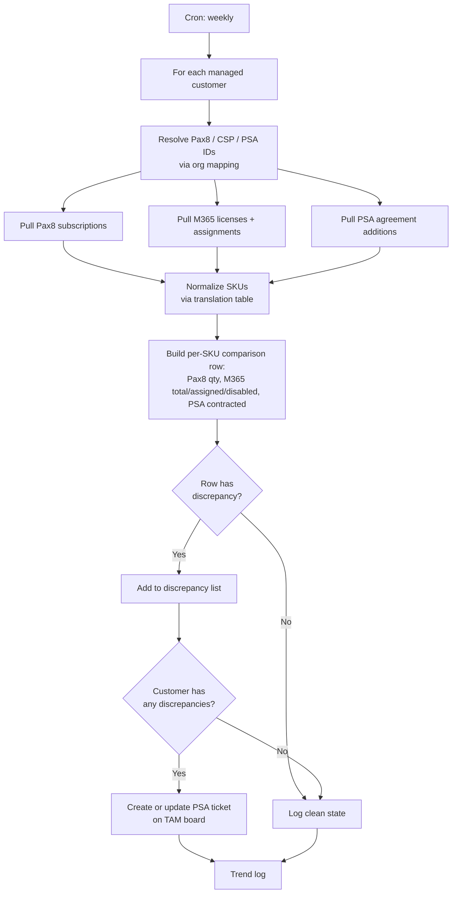

# M365 ↔ Pax8 ↔ PSA License Reconciliation

**Category:** license-cost
**Primary tools:** Pax8, Microsoft 365 (Graph), ConnectWise PSA
**Orchestrator:** tool-agnostic (originally Rewst)
**Status:** Production
**Effort to build:** L

## Problem
For every managed customer, three different systems hold a piece of the M365 license truth:

- **Pax8** knows what the MSP bills the customer for (the wholesale-to-retail layer).
- **Microsoft 365** knows what licenses are actually provisioned in the tenant and assigned to users.
- **ConnectWise PSA** knows what the customer is contracted for as additions on their agreement.

In theory these three should match. In practice they drift constantly: a license is added in one system and not the others; a user is offboarded but their license stays assigned; a SKU is purchased but never assigned; the agreement-additions number gets stale. Drift is silent and ages badly — by the time month-end reconciliation finds it, the variance is months old.

A weekly automated three-way recon catches drift while it's still cheap to fix.

## Trigger
Cron — weekly, off-hours.

## Data sources
- Pax8: subscription list per customer (SKU, quantity, billing period).
- Microsoft 365 (per customer tenant, via Graph under GDAP): license inventory (SKU, total seats, assigned seats, unassigned seats, assigned-to-disabled-user count).
- ConnectWise PSA: agreement additions for each managed customer (SKU, contracted quantity).
- Internal organization mapping: customer → Pax8 customer ID → CSP tenant ID → PSA company ID.

## Flow shape

1. Cron fires.
2. For each managed customer, resolve identifiers across Pax8, M365, and PSA.
3. Pull Pax8 subscriptions for the customer.
4. Pull M365 license inventory and assignments for the customer's tenant via Graph.
5. Pull PSA agreement additions for the customer's managed-services agreement.
6. Normalize SKU names — these are inconsistent across vendors. Maintain a SKU translation table (Pax8 SKU ↔ M365 SKU ↔ PSA addition).
7. For each normalized SKU, build a row: `(SKU, Pax8 qty, M365 total seats, M365 assigned, M365 assigned-to-disabled, PSA addition qty)`.
8. Identify discrepancies per row: Pax8 ≠ M365 total, M365 assigned > Pax8 qty, PSA addition ≠ Pax8 qty, etc.
9. Generate a per-customer reconciliation report (CSV or structured note) listing all SKUs with their quantities and flagging discrepancies.
10. For customers with discrepancies, create a ConnectWise ticket on the customer's TAM/agreement-management board with the report attached.
11. For customers with no discrepancies, log the clean state for trend reporting and move on.

## Outputs / side effects
- ConnectWise tickets created on the appropriate billing/agreement board for customers with license drift.
- Per-customer reconciliation reports stored or attached to tickets.
- Long-running structured log so trend analysis is possible (which SKUs drift most often, which customers are most volatile, are we converging or diverging over time).

## Outcome / value
License drift is caught within a week instead of within a quarter. The MSP can defend its margin: assigned seats that exceed billed quantities (the most common loss case) are surfaced before they accumulate into a meaningful invoice problem. Conversely, over-purchased seats (paying Pax8 for more than M365 is provisioning) show up too — and those are pure savings when caught.

For TAMs and account managers, the recon report is a high-quality artifact for the customer's quarterly review: "here's what you're paying for and what you're using, by SKU."

## Gotchas
- SKU normalization is the hard part of this pattern, and it's never finished. Microsoft renames SKUs, Pax8 catalog updates, the PSA addition list lags behind both. Maintain the translation table as a first-class artifact, version-controlled, with an owner.
- "Assigned to disabled user" is the most actionable category and the easiest to act on without thinking. Be careful — disabled users sometimes intentionally retain licenses (litigation hold, mailbox retention).
- Customer-tenant Graph permission via GDAP needs to be re-validated periodically; some customers will fall out of consent and silently start producing zero-license rows. Detect and flag this case rather than treating absence of data as "no licenses".
- Don't over-ticket. If the same drift exists between runs, update the existing ticket rather than creating a new one.
- Reserve the ticket-creation step for actionable drift. A single SKU off by one because Pax8's billing period boundary is off-by-a-day is not a useful ticket; figure out the right tolerance threshold per SKU class.

## Dependencies
- Pax8 API credentials.
- Microsoft Graph access into customer tenants (GDAP-scoped).
- ConnectWise PSA API credentials with read on agreements; write on tickets.
- A maintained SKU translation table.
- **Organization & site mapping across platforms** *(coming)*
- **GDAP customer-tenant authentication** *(coming)*
- [Error-handling pattern](../platform-ops/error-handling-with-ticket-creation.md).

## Related patterns
- [Unused M365 License Detection](./unused-m365-license-detection.md)
- **NCE renewal automation** *(coming)*
- **Inactive product feedback loop** *(coming)*
