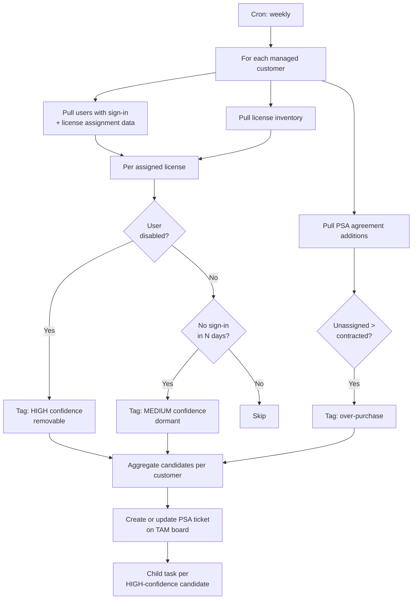

# Unused M365 License Detection

**Category:** license-cost
**Primary tools:** Microsoft 365 (Graph), ConnectWise PSA
**Orchestrator:** tool-agnostic (originally Rewst)
**Status:** Production
**Effort to build:** M

## Problem
Most managed customers carry a meaningful number of M365 licenses that nobody is using:

- Licenses assigned to disabled users.
- Licenses assigned to users with no sign-in activity for 60+ days.
- Unassigned licenses sitting in the available pool that exceed the contracted quantity.

These are real money — both for the customer (who is paying for empty seats) and for the MSP's billing accuracy. Manually auditing them is fiddly and tends to happen only when somebody asks.

A scheduled detection that produces a "here's what you can probably remove" ticket per customer makes this a recurring hygiene task instead of an occasional surprise.

## Trigger
Cron — weekly, off-hours.

## Data sources
- Microsoft 365 (per customer tenant, via Graph under GDAP): license inventory, user list with last-sign-in timestamps, account-disabled status, license assignments.
- ConnectWise PSA: managed-services agreement additions for the customer (contracted quantity per SKU).
- Internal organization mapping.

## Flow shape

1. Cron fires.
2. For each managed customer, resolve to the customer tenant ID and the PSA agreement.
3. Pull the user list for the tenant with: account-enabled flag, last-sign-in timestamp, list of assigned licenses.
4. Pull the license inventory for the tenant: per SKU, total seats, assigned, unassigned.
5. Pull the PSA agreement additions: per SKU, contracted quantity.
6. Identify candidates for removal:
   - Disabled user with assigned license (high confidence — almost always removable).
   - Enabled user with no sign-in in N days, where N is configured (e.g. 60). Lower confidence — may be a shared mailbox, a service account, a long-leave user.
   - Unassigned licenses exceeding contracted quantity (sign of an over-purchase).
7. For each candidate, classify by confidence (high / medium / low) and category (disabled, dormant, over-purchase).
8. Generate a per-customer report listing the candidates with category, confidence, and current cost-per-seat where known.
9. Create a ConnectWise ticket on the customer's TAM/agreement-management board with the report attached. Set a child task per high-confidence candidate so it can be actioned individually.
10. If a prior run already created a ticket and it's still open, append the new report rather than creating a duplicate.

## Outputs / side effects
- ConnectWise ticket per customer with a structured "removable licenses" report.
- Child tasks per high-confidence candidate (so progress can be tracked granularly).
- Structured log of total candidates surfaced per customer per run.

## Outcome / value
The "you're paying for licenses you don't need" conversation moves from one-off to recurring. Customers see real cost reductions. The MSP captures the value as a visible operational outcome (rather than something the customer's CFO eventually figures out themselves and uses against the contract). For high-license-count customers this can defensibly clear five-figure annual savings; for smaller customers the number is more modest but the trust effect is real.

This pattern also keeps the agreement-additions number honest. When seats are removed at the M365 layer, the agreement addition should be reduced too — that synchronization is a follow-on action and a candidate for further automation.

## Gotchas
- The "no sign-in in N days" rule is the noisiest signal. Test it against the customer's data before trusting it: shared mailboxes, room/equipment mailboxes, and service accounts will show up as dormant and are not actually removable.
- A user who has been on extended leave is a special case. If your customer base has any seasonal or contract workforce, give the rule a "do not flag" annotation per user.
- Some licenses are bundled (a user has a parent SKU that grants child SKUs). Don't double-count.
- Do not auto-remove. The pattern surfaces candidates; humans (the TAM, the customer) make the removal decision. Auto-removal is a separate, more cautious pattern that should not be merged with this one.
- The report's "cost-per-seat" number is sensitive. Be careful where the report ends up — at minimum, treat it as customer-confidential.

## Dependencies
- Microsoft Graph access into customer tenants (GDAP-scoped) with read permissions on users, sign-in activity, and licenses.
- ConnectWise PSA API credentials with read on agreements; write on tickets.
- [M365 ↔ Pax8 ↔ PSA License Reconciliation](./m365-pax8-psa-license-recon.md) — recommended foundation.
- **GDAP customer-tenant authentication** *(coming)*
- [Error-handling pattern](../platform-ops/error-handling-with-ticket-creation.md).

## Related patterns
- [M365 ↔ Pax8 ↔ PSA License Reconciliation](./m365-pax8-psa-license-recon.md)
- **NCE renewal automation** *(coming)*
