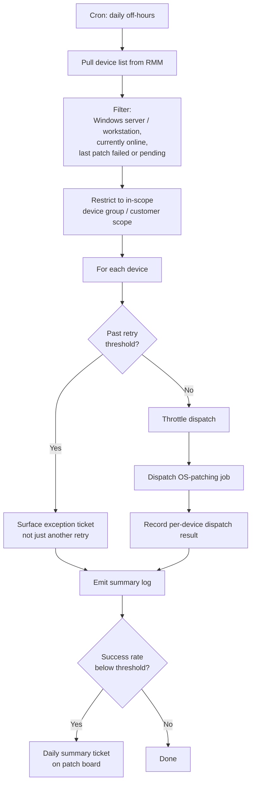

# RMM OS Patch Retry

**Category:** patch-lifecycle
**Primary tools:** NinjaOne
**Orchestrator:** tool-agnostic (originally Rewst)
**Status:** Production
**Effort to build:** S

## Problem
RMM-driven OS patching is reliable for the majority of devices and unreliable for a meaningful tail of them. Patches fail because the device is offline at the patch window, fails a precondition, runs out of disk, or hits a transient install error. The default RMM behavior is to log the failure and wait for the next scheduled cycle — which can be a week or more later.

Manually retrying failed patches doesn't scale. A scheduled retry that targets specifically the devices that failed and are now online closes the gap without operator effort.

## Trigger
Cron — daily or twice-weekly, scheduled outside customer business hours.

## Data sources
- NinjaOne: device list (online state, OS class, last-patch result), patch policies, patch-failure history.

## Flow shape

1. Cron fires.
2. Pull the device list from NinjaOne, filtered to:
   - Class: `WINDOWS_SERVER` and `WINDOWS_WORKSTATION`.
   - Online state: currently online.
   - Patch status: most recent patch run failed, or one or more patches are pending past their target window.
3. Restrict the target list to a configured device group / customer scope (the pattern is opt-in, not blanket).
4. For each qualifying device, dispatch the OS-patching job via NinjaOne's API.
5. Throttle dispatches to avoid hammering the RMM and customer networks.
6. Record per-device dispatch result (accepted / rejected / error).
7. Emit a structured summary log of attempts and the dispatcher's outcome.

## Outputs / side effects
- OS patch jobs queued via NinjaOne for the target devices.
- Structured log of per-run attempts and dispatch outcomes.
- Optionally: a daily summary ticket on a configured patch-management board if the success rate drops below a threshold.

## Outcome / value
The "long tail" of devices that failed their first patch attempt gets retried without human intervention. Patch compliance numbers — which most MSPs report on either contractually or for compliance — converge faster. Devices that have been failing repeatedly stand out clearly in the trend log, which is a better signal than scanning the RMM console manually.

The same pattern, with a small tweak, handles software-patch retries the same way.

## Gotchas
- "Online" in the RMM is not the same as "ready to patch". A device that just came online may still be establishing connectivity; throttle and stagger.
- Don't retry indefinitely. After N retries, the device has a real problem (disk space, locked update agent, broken WSUS, corrupt update store) and needs a human. Surface those as exception tickets rather than burning more retry attempts.
- Customer change-windows. Some customers explicitly forbid patches outside specific hours. Encode this per customer rather than per device.
- Reboots are the patch step that breaks production. The retry pattern should never silently reboot a server — defer the reboot to the next scheduled maintenance window or require an explicit per-device flag.
- Be cautious on domain controllers and other infrastructure-class servers. A configured exclusion list is safer than relying on convention.

## Dependencies
- NinjaOne API credentials with read on devices and patch status; permission to dispatch patch jobs.
- A configured device-group / customer scope.
- [Error-handling pattern](../platform-ops/error-handling-with-ticket-creation.md).

## Related patterns
- **Software patch retry** *(coming)*
- **OS patch compliance report** *(coming)*
- **Windows 11 upgrade campaign** *(coming)*
