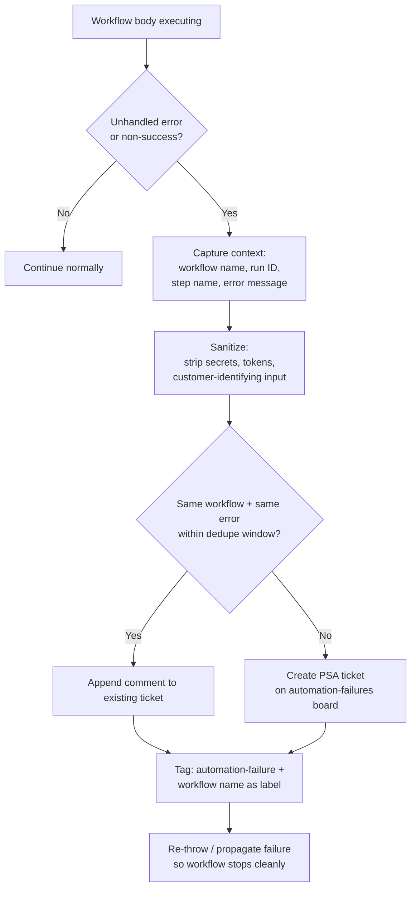

# Error Handling with Automated Ticket Creation

**Category:** platform-ops
**Primary tools:** ConnectWise PSA, plus whatever orchestrator the MSP runs
**Orchestrator:** tool-agnostic
**Status:** Production
**Effort to build:** S (per workflow), M (the first time, including the shared service)

## Problem
A workflow that fails silently is worse than a workflow that doesn't exist. The team trusts the workflow is running; the workflow has been broken for a month; nobody noticed because it wasn't producing tickets — or it stopped producing tickets, which the dashboards interpreted as "calm" instead of "broken".

Every production automation needs a consistent failure path: when something goes wrong, the failure becomes a ticket on a configured engineering board with enough context to triage. This sounds obvious. It's the most-skipped pattern in MSP automation.

## Trigger
Caught exception or non-success result inside any production workflow.

## Data sources
- The failing workflow's own context (which workflow, which run, which step, the error message, the input that caused it where safe to capture).
- ConnectWise PSA: write access to a configured engineering / automation-failures board.

## Flow shape

1. Inside every production workflow, wrap the body in an error handler — try/catch in code, error trigger node in n8n, catch-all branch in Rewst.
2. On any unhandled error or non-success result:
   1. Capture the workflow name and run identifier.
   2. Capture the failing step / node name.
   3. Capture the error type and message. Sanitize: strip secrets, tokens, customer-identifying input data that doesn't need to be in the ticket.
   4. Capture a short slice of input context — enough to reproduce, not so much that it leaks.
3. Compose a ConnectWise ticket on the configured engineering board:
   - Title: `[<env>] <workflow-name> failed at <step>`
   - Body: the captured context, a link to the run if the orchestrator exposes a stable URL (private; not in the customer-facing field), and a "next steps" hint.
4. De-duplicate: if the same workflow has failed in the same way within the last N minutes, append a comment to the existing open ticket instead of creating a new one. (Without this, a misconfigured workflow can create hundreds of tickets in an hour.)
5. Tag the ticket consistently (`automation-failure`, the workflow name as a label) so reporting can pull these into a dashboard.
6. Re-throw or otherwise propagate the failure so the workflow stops cleanly. The ticket creation is *not* a substitute for actually stopping.

## Outputs / side effects
- A ConnectWise ticket on the automation-failures board, with structured context and proper tagging.
- De-duplicated to avoid ticket-storm scenarios.
- Original workflow halts.

## Outcome / value
Failures become visible. The team has one place to look when something stops working, instead of N orchestrator UIs. Mean-time-to-detect on a broken automation drops from "next time someone notices" to "the next time the workflow fires".

This pattern is the single most important platform-level investment for an MSP automation program. Every other pattern in this repo depends on it implicitly — pattern cards reference it as a dependency for a reason.

## Gotchas
- Sanitization of the captured context is critical. The error path is exactly where workflows tend to leak unsanitized data into tickets, because the engineer who built the catch was thinking about debuggability, not customer privacy. Treat sanitization as part of the pattern, not an afterthought.
- Don't include API keys, tokens, OAuth secrets, or webhook URLs in the ticket body. Ever. If your error message contains them, scrub before writing.
- Workflow-run URLs in the ticket body are useful but tempting to leak. Keep them in an *internal-only* note, not in any customer-visible note field.
- Set a reasonable de-dup window. Too short and you get ticket storms; too long and you miss new failures of the same workflow during an outage.
- Do *not* swallow exceptions in pursuit of robustness. The pattern is "make the failure visible AND propagate", not "catch and continue". Continuing past an unhandled exception is how silent corruption happens.

## Dependencies
- ConnectWise PSA API credentials with write on tickets.
- A configured engineering / automation-failures board.
- A consistent workflow-naming convention (so the ticket title is machine-parseable for reporting).

## Related patterns
- **Logging and observability for workflows** *(coming)*
- **Production-readiness review** *(coming)*
- This pattern is referenced as a dependency by virtually every other pattern in the repo.
