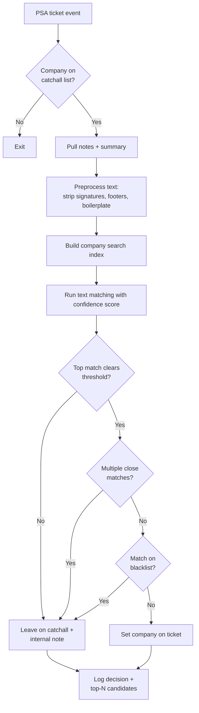

# Catchall Company Name Remap

**Category:** psa-ticketing
**Primary tools:** ConnectWise PSA
**Orchestrator:** tool-agnostic (originally Rewst)
**Status:** Production
**Effort to build:** M

## Problem
Tickets routinely arrive at the PSA with the wrong company attached — usually a generic catchall ("Microsoft", "Email Inbound", "Unknown") because the email parser couldn't identify the sender, or because the originating system writes a fixed company by default. A human then has to read the ticket, figure out which managed customer it actually belongs to, and remap it.

At scale this is a meaningful chunk of triage time, and it delays SLA timers because the ticket is sitting on the wrong queue.

## Trigger
PSA event — ticket created with company set to a configured "catchall" value (or any value on a configured ignore list).

## Data sources
- ConnectWise PSA: ticket (subject, summary, internal notes, contact email), full company list (active managed customers, their domains, contact patterns).

## Flow shape

1. Ticket arrives. Confirm the company on the ticket is one of the configured catchall/ignore values; otherwise exit.
2. Pull the ticket's notes and summary text.
3. Preprocess the text: strip signatures, footers, vendor noise, common boilerplate. Normalize whitespace.
4. Pull the active company list and build a search index of company names, common aliases, and email-domain patterns.
5. Run text matching with a confidence score. Exact-word matches and email-domain hits score highest; partial substring matches score lower.
6. If the top match clears a confidence threshold and is not on a blacklist (e.g. companies that share words with vendors), set it on the ticket.
7. If no match clears threshold, leave the ticket on the catchall and add an internal note explaining the matcher ran and didn't find anything.
8. If multiple matches are close, leave the ticket on the catchall and add an internal note listing the top candidates with their scores.
9. Log the decision (ticket ID, original company, matched company or null, top-N candidates with scores).

## Outputs / side effects
- ConnectWise ticket re-companied to the matched managed customer.
- Internal note on the ticket documenting the matcher's decision and confidence.
- Structured log for tuning the threshold and the alias list.

## Outcome / value
Most catchall tickets get re-companied to the right customer within seconds of arrival, instead of waiting for a human triage pass. Service desk wakes up to a queue that's already mostly correctly attributed. The `mis-companied` problem stops being a manual triage task and becomes an exception-only task — only the genuinely ambiguous tickets need human judgment.

## Gotchas
- The ignored/blacklisted list is critical. Without it, the matcher will confidently mis-assign tickets that mention vendor names ("Microsoft", "Cisco") to the wrong customer.
- Confidence threshold tuning is empirical. Start conservative (only act on very-high-confidence matches), watch the false positives, lower it gradually.
- Don't auto-remap on customers whose names are short common words. Use email-domain matching as the primary signal for those.
- Sync errors from PSA-to-third-party connectors (e.g. tickets auto-created by a vendor sync where the company defaults to "Microsoft") are a common source of catchall traffic. Patterns like this often pair with a sync-error-aware variant that reads ticket body for tenant-domain patterns.

## Dependencies
- ConnectWise PSA API credentials with read on companies and tickets; write on tickets.
- A maintained list of catchall company values to act on, and an ignore list of companies the matcher must never assign to.
- [Error-handling pattern](../platform-ops/error-handling-with-ticket-creation.md).

## Related patterns
- [Ticket Agreement Matcher](./ticket-agreement-matcher.md)
- **Stale Ticket Daily Digest** *(coming)*
