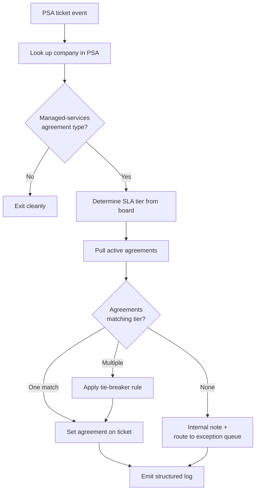

# Ticket Agreement Matcher

**Category:** psa-ticketing
**Primary tools:** ConnectWise PSA
**Orchestrator:** tool-agnostic (originally Rewst)
**Status:** Production
**Effort to build:** M

## Problem
On managed-services agreements, every ticket should be billed against the correct service-level agreement (L1, L2, L3, after-hours, project, etc.) for the customer. In practice, techs forget — they pick the default agreement, the wrong agreement, or none at all. The result is silent revenue leakage on out-of-scope work, audit pain at month-end, and friction with finance when tickets ship with mis-billed time.

Manual review by service-desk leads catches some of it. Catching all of it is impractical at scale.

## Trigger
PSA event — fires when a ticket is created, updated, or moved to a board where agreement matching matters.

## Data sources
- ConnectWise PSA: company record (managed-services flag, contracted SLA tier), service ticket (current agreement, service board, status, type), agreements list for the company (active agreements with SLA tier metadata).

## Flow shape

1. Ticket event arrives at the orchestrator via webhook.
2. Look up the ticket's company in ConnectWise PSA.
3. Confirm the company is on a managed-services agreement type. If not, exit cleanly — this pattern does not touch break-fix or T&M tickets.
4. Inspect the ticket's current service board to determine the SLA tier required (L1, L2, L3, after-hours, project, etc.).
5. Pull the company's active agreements; match the required tier against the agreements available.
6. If exactly one agreement matches the tier, set it on the ticket.
7. If multiple agreements match, prefer the most specific (e.g. an after-hours agreement over a generic L2 agreement) and log the choice.
8. If no agreement matches, write an internal-only note on the ticket and route to a configured exception queue rather than silently leaving it wrong.
9. Emit a structured log entry with ticket ID, prior agreement, new agreement, decision rationale.

## Outputs / side effects
- ConnectWise ticket updated with the matched agreement.
- For ambiguous or unmatched tickets, an internal note is added and the ticket lands on an exception queue.
- Structured log written for downstream reporting (how often this fires, how often it had to escalate, where the misses are concentrated).

## Outcome / value
Eliminates the most common cause of misbilled time entries on managed-services contracts. Service-desk leads stop spending hours per week reviewing agreement assignments. Finance gets cleaner invoices. The exception queue surfaces the genuinely ambiguous cases that *should* have human judgment, instead of those cases hiding in noise.

This pattern, with two near-twins (the timesheet-side variant and the cancelled-ticket variant), tends to pay for itself in the first month at most MSPs that run a few hundred managed-services tickets per week.

## Gotchas
- Boards aren't always a clean signal of SLA tier. Some MSPs use a single board for multiple tiers and disambiguate via ticket type or priority. Build the tier-determination step against your *own* board taxonomy, not a vendor template.
- Companies sometimes have multiple agreements at the same tier (e.g. legacy + replacement during transition). Encode the tie-breaking rule explicitly.
- "Cancelled" and "denied" tickets need their own variant — a cancelled ticket should still attach to the right agreement so the time-tracking history is accurate, but the matching rule may differ.
- Webhook idempotency. The same ticket update can fire the workflow twice. Skip the work if the agreement is already correct.

## Dependencies
- ConnectWise PSA API credentials with read on companies, tickets, agreements; write on tickets.
- An agreed taxonomy of service boards → SLA tiers, kept in configuration (not hard-coded).
- [Error-handling pattern](../platform-ops/error-handling-with-ticket-creation.md) — to capture API failures as actionable tickets rather than silent retries.

## Related patterns
- **Auto-close cancelled tickets** *(coming)*
- [Catchall company name remap](./catchall-company-name-remap.md)
