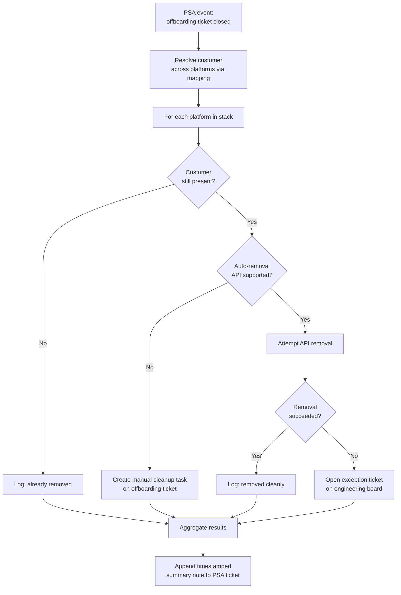

# Offboarded Client System RECON

**Category:** reconciliation
**Primary tools:** ConnectWise PSA, NinjaOne, SentinelOne, Huntress, Auvik, Liongard
**Orchestrator:** tool-agnostic (originally n8n)
**Status:** Production
**Effort to build:** L

## Problem
Offboarding a managed customer is a multi-platform task: their devices, sites, and tenants need to be removed from the RMM, the EDR/MDR platforms, the network monitoring tool, the documentation tool, and so on. In practice, things get missed. Months later, a former customer is still consuming agent licenses, still appearing in dashboards, still generating telemetry that nobody is actioning.

The cost is real — license waste, security-policy confusion, and a non-zero data-handling risk for a customer who is no longer under contract.

## Trigger
PSA event — a customer's status on the Client Offboarding board moves to `Closed` (or the equivalent terminal status that means "offboarding complete from a project-management standpoint").

## Data sources
- ConnectWise PSA: the offboarding board (closed status), the company record (the customer being offboarded).
- NinjaOne: organization existence; if found, the org's sites and devices.
- SentinelOne: site existence; if found, agents in the site.
- Huntress: organization existence; if found, agents and accounts.
- Auvik: collector/site existence.
- Liongard: environment existence.
- A configured list of any other platforms in the MSP's stack (documentation tool, backup tool, billing platform).

## Flow shape

1. PSA event fires when the offboarding ticket closes.
2. Resolve the customer to their identifiers across each platform via the organization mapping.
3. For each platform, check whether the customer organization still exists.
4. For platforms where the customer is gone, log "already removed" and continue.
5. For platforms where the customer is still present, determine whether the platform supports automated removal of the org / its assets via API. If yes, attempt the removal.
6. For platforms that don't support automated removal (or where the API surface is restricted), generate a ConnectWise task on the offboarding ticket with the specific manual step required ("manually remove org X from platform Y; URL in playbook").
7. Aggregate all per-platform results into a single summary note on the offboarding ticket: what was auto-removed, what is now confirmed clean, what still requires a manual step.
8. If any auto-removal failed (auth error, partial success), open an exception ticket on the appropriate engineering board so it doesn't get lost in the offboarding noise.
9. Update the offboarding ticket with the timestamped recon report.

## Outputs / side effects
- Devices, sites, organizations removed from the platforms that support API-driven cleanup.
- Manual cleanup tasks created for the platforms that don't.
- A timestamped audit note on the PSA offboarding ticket summarizing the cross-platform state.
- Exception tickets for any failed auto-removal attempts.

## Outcome / value
Offboarding actually finishes. The MSP stops paying for agent licenses on customers who have been gone for six months. The "we promise we removed your data" claim made to departing customers becomes a defensible audit trail rather than a hopeful assertion. Service delivery gets visibility into which platforms tend to leak — over time the audit log shows where the manual gaps are and where automation should be deepened next.

## Gotchas
- "Removal" means different things on different platforms. Some support delete; some only support archive; some only support "deactivate the site but keep historical data." Decide what the right action is per platform before automating.
- Don't run the auto-removal until the human-driven offboarding ticket is genuinely closed. Race conditions where the workflow fires on a not-yet-final status will delete real customers' data.
- Liongard environments often hold valuable historical data (configs, change history) that may need to be retained on a legal-hold basis. Encode the retention rule per platform.
- API permissions to delete organizations are usually restricted. Plan the credential model; you may need a service principal with a higher trust level than the day-to-day credentials.
- Some platforms create dependencies that block deletion (e.g. site has agents → must offboard agents first → which may require the agent to be online). Sequence the platforms accordingly and tolerate partial completion across runs.

## Dependencies
- An organization mapping that links the PSA company ID to the platform-specific organization/site identifiers across the entire stack.
- API credentials with delete or archive scope on each platform that supports it.
- **Organization & site mapping across platforms** *(coming)*
- [Error-handling pattern](../platform-ops/error-handling-with-ticket-creation.md).

## Related patterns
- [RMM ↔ EDR ↔ Identity Agent Recon](./rmm-edr-agent-recon.md)
- **Employee offboarding** *(coming)*
