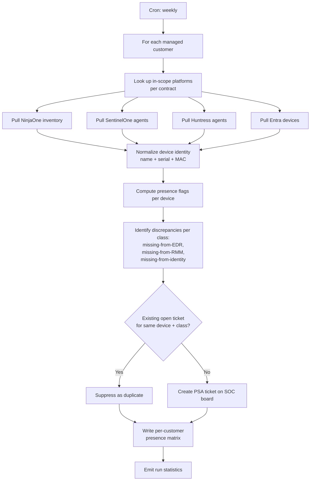

# RMM ↔ EDR ↔ Identity Agent Recon

**Category:** reconciliation
**Primary tools:** NinjaOne, SentinelOne, Huntress, Microsoft Entra
**Orchestrator:** tool-agnostic (originally Rewst)
**Status:** Production
**Effort to build:** L

## Problem
Every MSP claims to manage and protect a list of devices. The truth is more complicated: the device that exists in the RMM might be missing from one of the EDR/MDR platforms, or vice versa. New devices show up in identity providers without ever landing in the RMM. Decommissioned devices linger in one tool but not the others. This silent drift means the protection posture you sell to customers is not the protection posture they actually have.

Periodic manual recon — "let's spot-check the agent counts this month" — finds the obvious gaps and misses the long tail. Customers find the rest, usually during an incident.

## Trigger
Cron — weekly, off-hours.

## Data sources
- NinjaOne: full device inventory (workstations and servers), per-organization, including online/offline state and OS class.
- SentinelOne: full agent inventory across managed sites, including agent health and last-seen.
- Huntress: agent inventory across managed organizations.
- Microsoft Entra (workstations / VMs joined to customer tenants): device list for Azure AD-joined endpoints, where applicable.
- ConnectWise PSA: company-to-tool mapping (which customers are on which platforms; expectations per customer).

## Flow shape

1. Cron fires.
2. For each managed customer in the PSA, look up which platforms are in scope per their contract.
3. For each in-scope platform, pull the customer's full device/agent list with stable identifiers (device name, serial, MAC, or platform-specific ID — whatever the platform exposes consistently).
4. Normalize device identity across platforms: matching by name is fragile, matching by serial + MAC is better, matching by all three with a confidence score is best.
5. For each device, compute presence flags per platform: `(in NinjaOne, in SentinelOne, in Huntress, in Entra)`.
6. Identify discrepancies — devices present in one platform and missing from another where they're expected to be.
7. For each discrepancy class (missing-from-EDR, missing-from-RMM, missing-from-identity), generate a ConnectWise ticket on the appropriate board with the device details and the expected vs. actual matrix.
8. Skip ticket creation for discrepancies already represented by an open ticket from a prior run (idempotency by device + discrepancy type).
9. Write a per-customer summary record to the durable store for the dashboard pattern (see related).
10. Emit a structured log of run statistics (devices scanned per platform, discrepancies found, tickets created, tickets suppressed as duplicates).

## Outputs / side effects
- ConnectWise tickets created for actionable discrepancies, routed to the SOC or the appropriate engineering team.
- Per-customer device-presence matrix written to durable storage so service-delivery managers can review the long tail without waiting on a ticket.
- Structured log for trend analysis across runs.

## Outcome / value
The "what we sold" vs. "what we deployed" gap closes. Newly-onboarded customers stop having month-three surprises where one platform was never fully rolled out. The SOC gets a recurring, structured stream of "this device should have an EDR agent and doesn't" tickets — far more useful than the same information arriving as ad-hoc Slack messages from techs who happened to notice.

This is one of the highest-leverage automations in any MSP stack. It turns the trust-but-verify problem into a closed loop.

## Gotchas
- Device identity is the hard part. Names get changed, MACs change on dock swaps, serials are sometimes blank in RMM. Build identity matching as its own component with explicit confidence scoring; you'll tune it for years.
- Pagination. Every one of these APIs paginates. Off-by-one or "I assume the dataset fits in one page" is the most common cause of false-positive discrepancies.
- "Missing" can mean "uninstalled" or "never deployed" or "agent dead" — these need different remediation paths. Encode the flavor of missingness in the ticket subject so the SOC can prioritize.
- Customer-tenant Entra reads need GDAP and a customer-by-customer onboarding flow. Don't gate the whole pattern on Entra coverage; the RMM/EDR triple-recon is valuable on its own.
- Some platforms have devices that are *intentionally* outside one of the systems (e.g. a hypervisor host without an EDR agent). Encode the intentional exceptions in configuration, per customer, or you'll generate noise tickets forever.

## Dependencies
- API credentials with read scope on every platform listed.
- An organization mapping that tells the workflow which sites/orgs in each platform belong to which PSA company.
- **Organization & site mapping across platforms** *(coming)*
- [Error-handling pattern](../platform-ops/error-handling-with-ticket-creation.md).

## Related patterns
- [Offboarded Client System RECON](./offboarded-client-recon.md)
- **Per-customer device dashboard** *(coming)*
- **SentinelOne default-site endpoint cleanup** *(coming)*
