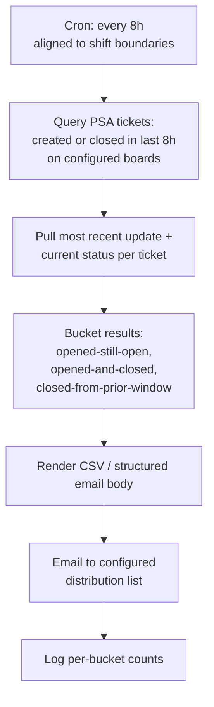

# Eight-Hour Ticket Activity Digest

**Category:** reporting
**Primary tools:** ConnectWise PSA
**Orchestrator:** tool-agnostic (originally Rewst)
**Status:** Production
**Effort to build:** S

## Problem
Service-delivery leadership wants near-real-time awareness of ticket activity on specific PSA boards without checking the PSA UI throughout the day. Without it, tickets that are opened or closed late in the day go unnoticed until the next morning, which can hide both customer-affecting issues and unusual ticket-volume spikes that warrant investigation.

A daily summary at end-of-day is too coarse. A real-time alert per ticket is too noisy. An eight-hour rollup hits the right granularity for shift-based attention.

## Trigger
Cron — every 8 hours, aligned to the team's shift boundaries.

## Data sources
- ConnectWise PSA: tickets created or closed in the last 8 hours on a configured set of service boards. For each ticket: most recent update text, current status, owner, board.

## Flow shape

1. Cron fires.
2. Query ConnectWise PSA for tickets opened *or* closed within the last 8 hours, filtered to the configured boards.
3. For each ticket, pull the most recent update note and the current status.
4. Bucket the results: opened-and-still-open, opened-and-closed-same-window, closed-from-prior-window.
5. Render the result as a CSV (or a structured email body) with one row per ticket and one section per bucket.
6. Email the result to a configured distribution list.
7. Log run statistics — number of tickets per bucket — for trend reporting.

## Outputs / side effects
- Email with the digest to a configured distribution list.
- Structured log of per-run counts per bucket.

## Outcome / value
Service-delivery leadership has a shift-aligned rolling view of ticket activity without checking the PSA UI. Late-day spikes in creation or closure are visible the same shift. Long-running tickets that *aren't* moving are conspicuous by their absence from the digest, which is itself a signal.

This is one of the easiest patterns to ship and one of the most-used by people who didn't know they needed it. Worth doing early.

## Gotchas
- ConnectWise pagination — the digest under-reports if the result set exceeds one page and pagination isn't handled. This is the most common defect in this pattern's first implementation.
- Time-zone discipline. The PSA stores times in its own time zone; the orchestrator runs in another; the recipients are in a third. Pick one and document it on the digest itself (e.g. a header line that says which zone the timestamps below are in).
- Distribution list management. Keep recipients in configuration, not hard-coded. People come and go; a hard-coded list ages badly.
- Boards-to-include is sensitive. Including the SOC board floods the digest; including only one team's boards starves the others. Make it configurable per recipient if needed.
- The digest is not a paging tool. If you need real-time alerting on critical tickets, that's a different pattern (event-driven webhook → on-call escalation).

## Dependencies
- ConnectWise PSA API credentials with read on tickets, ticket notes, and boards.
- A configured list of boards and a configured recipient list.
- [Error-handling pattern](../platform-ops/error-handling-with-ticket-creation.md).

## Related patterns
- **Stale ticket daily digest** *(coming)*
- **Service desk timesheet daily HTML report** *(coming)*
