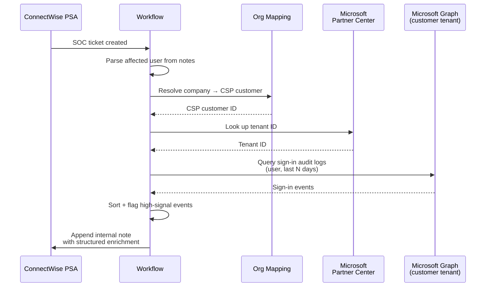

# EDR Alert Enrichment with Sign-In Logs

**Category:** security-alerting
**Primary tools:** Huntress, ConnectWise PSA, Microsoft Graph (sign-in audit logs), Microsoft Partner Center / CSP
**Orchestrator:** tool-agnostic (originally Rewst)
**Status:** Production
**Effort to build:** M

## Problem
EDR/MDR platforms produce account-level alerts ("user signed in from a new country", "impossible travel", "suspicious mailbox rule") that the SOC needs to action. The alert itself is rarely enough — the analyst has to pivot into the customer's tenant, pull recent sign-in audit logs for the user, and decide whether the alert is genuine or noise.

That pivot is repetitive, slow, and bottlenecked on the analyst remembering which customer is in which CSP relationship. Enriching the alert ticket with the relevant sign-in audit data on creation lets the SOC triage at a glance instead of after a five-minute pivot.

## Trigger
PSA event — a ticket created by the EDR/MDR platform's connector hits the SOC board.

## Data sources
- ConnectWise PSA: the alert ticket (notes, summary).
- Internal organization mapping: ticket → customer → CSP customer ID → tenant ID.
- Microsoft Partner Center / CSP: customer record (resolves to tenant ID under GDAP).
- Microsoft Graph (customer tenant, scoped via GDAP): sign-in audit logs for the user, in a configured look-back window.

## Flow shape

1. SOC ticket arrives at the orchestrator via PSA event.
2. Parse the ticket notes to extract the affected user's email (or username).
3. Resolve the ticket's company → customer → CSP customer ID via the organization mapping.
4. Look up the customer's tenant ID in Partner Center.
5. Query Microsoft Graph in the customer tenant for sign-in audit logs for the affected user, filtered to the look-back window (e.g. last 7 days).
6. Sort the logs by timestamp; flag entries that match common high-signal patterns (new country, new device, failed-then-success, MFA challenge denied).
7. Format the result as a structured note (compact table or bullet list) and append it to the ticket as an internal note.
8. If the Graph call fails (auth, throttling, customer not in CSP under expected GDAP role), surface the failure in the ticket note rather than silently skipping — the analyst needs to know whether absence of data means "no logs" or "couldn't retrieve".

## Outputs / side effects
- An internal note on the SOC ticket containing recent sign-in audit context for the affected user.
- On enrichment failure: an explicit "enrichment failed for reason X" note so the analyst can act on what the data does and doesn't say.

## Outcome / value
SOC analysts triage account-level EDR alerts faster. The "go pivot into the customer tenant" step happens once, automatically, on ticket creation, instead of every time an analyst picks up an alert. Easy-to-dismiss alerts (legitimate user, normal sign-in pattern) close faster; genuinely-suspicious alerts get escalated with the enrichment already in hand.

This pattern is also a foundation: once the enrichment pipeline exists, you can reuse it for any account-centric alert source (Huntress, sign-in risk in Entra, mail-flow rules, etc.) by pointing the same enrichment service at different alert intake paths.

## Gotchas
- Customer-tenant Graph calls require GDAP scopes that are correct *and* accepted by the customer. A non-trivial percentage of customers will fail the lookup until consent is reissued. Track and report on this; don't paper over it.
- Don't include sign-in audit data that isn't relevant. Logs from outside the look-back window add noise and extend ticket length without value.
- Be deliberate about what to flag. False high-signal flags train the SOC to ignore them.
- Service-account sign-ins and break-glass accounts have unique patterns; either exclude them from enrichment or label them clearly.
- Idempotency: the connector may retry-create the same ticket. Don't append the enrichment twice.

## Dependencies
- ConnectWise PSA API credentials with read/write on tickets.
- Microsoft Partner Center API access.
- GDAP-scoped Graph access into customer tenants for sign-in audit logs.
- **Organization & site mapping across platforms** *(coming)*
- **GDAP customer-tenant authentication** *(coming)*
- [Error-handling pattern](../platform-ops/error-handling-with-ticket-creation.md).

## Related patterns
- **SentinelOne quarantine-file alerts** *(coming)*
- **SentinelOne default-site endpoint cleanup** *(coming)*
